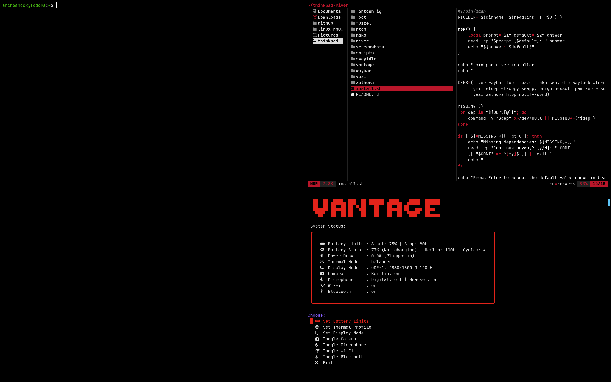

# thinkpad-river

[](LICENSE)
[](https://kernel.org)
[](https://wayland.freedesktop.org)
[](https://codeberg.org/river/river)
[](https://www.lenovo.com/thinkpad)
[](https://kernel.org)

A barebones Wayland rice for ThinkPads, built on [River](https://codeberg.org/river/river). No wallpaper, no compositor effects, no decorations — nothing that doesn't serve a direct purpose. Pure black everywhere, subpixel rendering disabled, optimized for OLED panels. TrackPoint, ELAN touchpad, battery thresholds, thermal profiles, and hardware controls are all first-class concerns via [vantage](https://github.com/AdmiralBarbarossa/Minimal-vantage). Keyboard-driven throughout with vim-style navigation.



## Stack

| Role | Tool |
|---|---|
| Compositor | River |
| Status bar | Waybar |
| Terminal | Foot |
| Launcher | Fuzzel |
| Notifications | Mako |
| File manager | Yazi (custom theme: [thinkpad-red-oled](https://github.com/AdmiralBarbarossa/thinkpad-red-oled.yazi)) |
| PDF viewer | Zathura |
| Idle / lock | Swayidle + Waylock |
| Night light | Wlsunset |
| Hardware TUI | [Vantage](https://github.com/AdmiralBarbarossa/Minimal-vantage) |

## Requirements

- Linux kernel 5.17+ (battery threshold support)
- River (includes rivertile), Waybar, Foot, Fuzzel, Mako, Swayidle, Waylock
- Wlr-randr (already bundled with River setups), Wlopm
- Grim, Slurp, Wl-clipboard, Swappy (screenshots)
- Brightnessctl, Pamixer, Wlsunset, libnotify (notify-send)
- Yazi, Zathura, Htop
- Qt6ct (Qt theming — required for Qt apps to respect the dark theme)
- JetBrainsMono Nerd Font
- `gum` (required by vantage)

## Installation

```bash
git clone --recurse-submodules https://github.com/AdmiralBarbarossa/thinkpad-river
cd thinkpad-river
./install.sh
```

The installer will ask for your display output names, mode, scale, repo location, and default browser — with your ThinkPad's defaults pre-filled. It then patches all configs in place and installs vantage.

Symlink the configs into `~/.config` (adjust the path if you cloned elsewhere):

```bash
RICE=~/thinkpad-river
ln -sf $RICE/river       ~/.config/river
ln -sf $RICE/waybar      ~/.config/waybar
ln -sf $RICE/foot        ~/.config/foot
ln -sf $RICE/fuzzel      ~/.config/fuzzel
ln -sf $RICE/mako        ~/.config/mako
ln -sf $RICE/swayidle    ~/.config/swayidle
ln -sf $RICE/yazi        ~/.config/yazi
ln -sf $RICE/zathura     ~/.config/zathura
ln -sf $RICE/htop        ~/.config/htop
ln -sf $RICE/fontconfig  ~/.config/fontconfig
```

> `fontconfig` disables subpixel hinting and LCD filtering — optimised for OLED panels where subpixel rendering causes colour fringing.

Create the River session service (required for `graphical-session.target` and xdg-desktop-portal):

```bash
mkdir -p ~/.config/systemd/user
cat > ~/.config/systemd/user/river-session.service << 'EOF'
[Unit]
Description=River Wayland compositor session
BindsTo=graphical-session.target
Wants=graphical-session-pre.target
After=graphical-session-pre.target

[Service]
Type=simple
ExecStart=/bin/true
RemainAfterExit=yes
EOF
```

Enable mako's systemd user service:

```bash
systemctl --user enable mako.service
```

## River Defaults

River ships with no keybindings or layout out of the box — everything must be configured explicitly. This rice wires up River's built-in features but does not modify their underlying behaviour:

- **Tiling** — rivertile, zero view padding and zero outer padding (no gaps)
- **Tags** — 9 tags configured, tag 1 focused on startup
- **Floating** — native float toggle, move, resize, and snap
- **Passthrough mode** — one passthrough mode declared for VM use
- **Locked mode** — volume and brightness keys remain active on the lock screen

**Explicitly set:**

- Border: 1px, focused `#707070`, unfocused `#000000`
- Key repeat: 300ms delay, 50 repeats/second
- Layout: rivertile with `-view-padding 0 -outer-padding 0`
- Background: `#000000`
- `GTK_CSD=0` — removes title bars from GTK apps globally

## Input Devices

Input configuration uses hardware-specific device identifiers for the keyboard, ELAN touchpad, and TrackPoint. These are tied to the hardware this was written on and may differ on other ThinkPad models. To find your device names:

```bash
riverctl list-inputs
```

Then update the corresponding lines in `river/init`.

**Touchpad (ELAN):** acceleration 0.6 adaptive, natural scroll, tap-to-click, clickfinger

**TrackPoint:** acceleration 0.8 adaptive

**Keyboard:** layout hardcoded to `us` — change `layout "us"` in `river/init` for other layouts

## Keybindings

### Applications
| Key | Action |
|---|---|
| `Super + Shift + Return` | Terminal (foot) |
| `Super + D` | Launcher (fuzzel) |
| `Super + W` | Browser |
| `Super + E` | File manager (yazi) |
| `XF86Assistant` | File manager (yazi) — ThinkPad AI key |
| `Super + N` | Toggle night light (3200K via wlsunset) |
| `Super + B` | Toggle waybar visibility |

### Windows
| Key | Action |
|---|---|
| `Super + J / K` | Focus next / previous |
| `Super + Shift + J / K` | Swap next / previous |
| `Super + Return` | Zoom (promote to main) |
| `Super + Space` | Toggle float |
| `Super + F` | Toggle fullscreen |
| `Super + Q` | Close |

### Layout
| Key | Action |
|---|---|
| `Super + H / L` | Adjust main ratio |
| `Super + Shift + H / L` | Adjust main count |
| `Super + Arrow keys` | Move main panel |

### Floating windows
| Key | Action |
|---|---|
| `Super + Alt + H/J/K/L` | Move |
| `Super + Alt + Ctrl + H/J/K/L` | Snap to edge |
| `Super + Alt + Shift + H/J/K/L` | Resize |
| `Super + Mouse left` | Drag |
| `Super + Mouse right` | Resize |
| `Super + Mouse middle` | Toggle float |

### Tags (workspaces)
| Key | Action |
|---|---|
| `Super + 1–9` | Focus tag |
| `Super + Shift + 1–9` | Move window to tag |
| `Super + Ctrl + 1–9` | Toggle tag focus |
| `Super + Shift + Ctrl + 1–9` | Toggle window's tag |
| `Super + 0` | View all tags |

### Outputs
| Key | Action |
|---|---|
| `Super + . / ,` | Focus next / previous output |
| `Super + Shift + . / ,` | Send window to next / previous output |
| `F7 (XF86Display)` | Cycle display modes (internal → external → extend) |

### Screenshots
| Key | Action |
|---|---|
| `PrtSc` | Full screen to `$XDG_PICTURES_DIR` (falls back to `~/Pictures`) |
| `F10 (XF86SelectiveScreenshot)` | Area to clipboard |
| `Super + Shift + S` | Area with editor (swappy) |

### Function keys
| Key | Action |
|---|---|
| `F1` | Mute |
| `F2` | Volume down |
| `F3` | Volume up |
| `F4` | Mic mute |
| `F5` | Brightness down |
| `F6` | Brightness up |
| `F8` | Cycle power profiles — handled by ThinkPad firmware, no keypress reaches River |
| `F12 (XF86Favorites)` | Htop |
| `Super + F11` | Toggle VM passthrough mode — suspends all River keybinds so the guest receives input directly; `Super + F11` again to exit |

> **Note:** Function key keycodes vary between ThinkPad models and FnLock state. Use [wev](https://git.sr.ht/~sircmpwn/wev) to inspect actual keycodes and adjust `river/init` accordingly.

### System
| Key | Action |
|---|---|
| `Super + Shift + X` | Lock screen |
| `Super + Shift + R` | Reload River config |
| `Super + Shift + E` | Exit River |

### Idle / power
| Timeout | Action |
|---|---|
| 60s | Dim display |
| 120s | Lock screen |
| 180s | Display off |
| 600s | Suspend |

## Idle & Lock

Swayidle manages all idle and sleep behaviour. Wlopm cuts display power at the 180s timeout without removing the output from River, so waylock keeps its surface through display-off and suspend. Swayidle runs with `-w` to hold a systemd sleep inhibitor; waylock runs with `-fork-on-lock` to fully grab the session lock before sleep proceeds.

**Lock screen colours:**
- Locked: `#000000` — black
- Typing: `#333333` — dark grey
- Failed attempt: `#b9162a` — ThinkPad red

## Notifications

Mako runs as a systemd user service, started on login. Configured with a dark theme and ThinkPad red accent for urgency.

- **Dismiss single:** right-click
- **Dismiss all:** middle-click
- **High urgency:** persistent (no timeout), red border
- **Default timeout:** 5 seconds

## Terminal

Foot is configured with:

- Scrollback: 5000 lines
- `$TERM`: `xterm-256color` — if you encounter compatibility issues with terminal apps, this is the first thing to check
- DPI-aware rendering enabled
- Cursor: blinking white beam
- Scroll wheel: scrollback navigation; `Ctrl + scroll` adjusts font size

## PDF Viewer

Zathura uses its default vim-style keybindings for navigation (`j/k` scroll, `gg/G` top/bottom, `/` search, `Tab` cycle links, `Enter` follow link). Only minimal settings are configured — clipboard integration enabled, 10% zoom step.

## System Monitor

Htop is pre-configured with a two-screen layout — the first shows processes sorted by CPU usage with frequency and temperature meters, the second shows I/O activity. This differs from stock htop's default single-screen view.

## Display Scaling

The internal display runs at 2880x1800 with a scale of 1.25. Integer scales (1×, 2×) are pixel-perfect but 2× is too large and 1× is too small for this panel. 1.25 gives a usable balance — fractional rounding is imperceptible on a dense OLED. XWayland apps render at 1× and get upscaled, which can look slightly soft. The logical resolution becomes 2304×1440, which affects multi-monitor positioning (see Known Limitations).

## Screenshot Cleanup

`scripts/screenshot-clean.sh` deletes screenshots older than 14 days from your pictures directory. Not wired up automatically — add it to a cron job or systemd timer:

```bash
0 0 * * * ~/thinkpad-river/scripts/screenshot-clean.sh
```

## Uninstall

```bash
rm -f ~/.config/river ~/.config/waybar ~/.config/foot ~/.config/fuzzel
rm -f ~/.config/mako ~/.config/swayidle ~/.config/yazi ~/.config/zathura
rm -f ~/.config/htop ~/.config/fontconfig
rm -f ~/.config/systemd/user/river-session.service
systemctl --user disable mako.service
sudo make -C ~/thinkpad-river/vantage uninstall
```

Adjust the path if you cloned elsewhere, then delete the repo directory.

## Known Limitations

- **`display-cycle.sh` extend position** — the external display offset is hardcoded as `--pos 2304,0` (2880 ÷ 1.25). If you install with a different internal resolution or scale, recalculate and update this value in `scripts/display-cycle.sh`.
- **`swayidle/config` inline output name** — `wlopm --off eDP-1` has the output name inlined; swayidle config is not a shell script. The installer patches it, but manual edits must keep it in sync.
- **Brief screen flash on resume** — a single desktop frame may be visible on resume before waylock redraws. This is a known wlroots limitation with no config workaround.
- **Waybar configs are intentionally separate** — `waybar/config` targets the internal display, `waybar/config-ext` the external. A single shared config does not work correctly across outputs. The only differences are the `output` field and the `backlight` module. Changes must be applied to both files.
- **Mako has no output binding** — notifications follow focus; on external-only mode they appear on the external display.

## Troubleshooting

**Display not initializing correctly on startup** — `river/init` delays the `wlr-randr` call by 0.5 seconds. On slower hardware this may not be enough — increase the delay in `river/init` to 1 or 2 seconds if the mode or scale isn't applied on login.

**Function keys not working** — use `wev` to confirm what keysym your hardware emits, then update the binding in `river/init`.

**Input device settings not applying** — run `riverctl list-inputs` to confirm your device names match the identifiers in `river/init`.

**Waybar not appearing or appearing blank on startup** — the init script sends `SIGUSR1` after 1 second to force a refresh. If the bar is still missing, `Super + Shift + R` will restore it.

**`Super + B` hides the bar but leaves a blank strip** — waybar's `"exclusive": true` reserves space regardless of hide state. Switching to `"exclusive": false` removes the strip but causes the bar to overlap content on reveal.

**xdg-desktop-portal not starting** — `river-session.service` must exist in `~/.config/systemd/user/`. See Installation.

**Lock screen not appearing on suspend** — confirm swayidle is running with `-w` (`pgrep -a swayidle`). Without it the system may suspend before waylock launches.

## License

MIT — see [LICENSE](LICENSE).